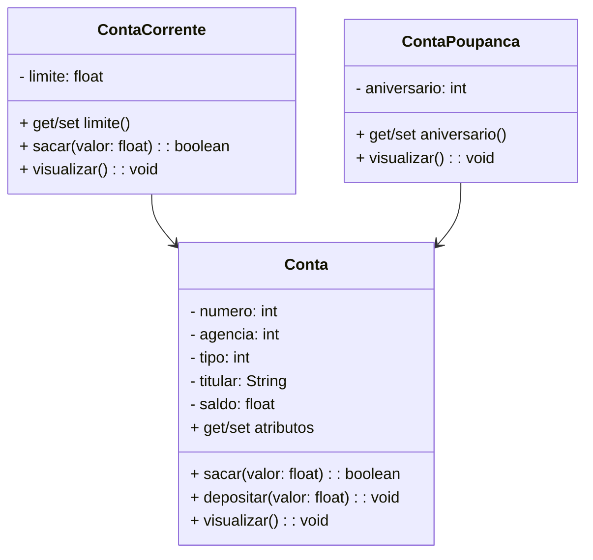

# 💳 Projeto Conta Bancária - Java

<br />

<div align="center">
	
</div>

<br />

<div align="center">
  
  
  
  
  
  
</div>

---

## 📌 Descrição

O **Projeto Conta Bancária** é um sistema de gestão bancária criado em **Java**, com foco total no aprendizado de **Programação Orientada a Objetos (POO)** 💡. Ele permite:

- 📥 Criar, consultar, editar e excluir contas;
- 💰 Realizar saques, depósitos e transferências;
- 👤 Gerenciar dados de contas correntes e poupanças.

Tudo foi desenvolvido aplicando os conceitos aprendidos nas aulas de:

📚 `variáveis`, `métodos`, `condições`, `loops`, `arrays`, `collections`, `exceptions`, `interfaces`, `lambdas`, `stream`, e muito mais!

---

## 🚀 Funcionalidades

1. 🆕 Criar Conta
2. 📋 Listar Contas
3. 🔍 Consultar Conta por Número ou Titular
4. ✏️ Editar Conta
5. ❌ Excluir Conta
6. 💸 Sacar
7. ➕ Depositar
8. 🔁 Transferir

---

## 📐 Diagrama de Classes

Visualize a estrutura do sistema com herança e polimorfismo aplicados 👇



---

## 🖥️ Tela Inicial do Sistema

<p align="center">
  <a href="https://github.com/user-attachments/assets/71017d7a-225a-40b9-b912-679392a83ba1">
    
  </a>
</p>

---

## 📚 O que aprendi com este projeto

Este projeto foi essencial para consolidar meus conhecimentos em Java 💻. Aprendi a:

- ✨ Aplicar os princípios da Programação Orientada a Objetos;
- 🔄 Criar estruturas de controle (if, switch, loops);
- 🧮 Trabalhar com arrays e collections;
- ❗ Tratar exceções corretamente;
- 🧩 Utilizar interfaces, lambdas e streams para tornar o código mais flexível e funcional.

---

## 🧗‍♂️ Desafios Enfrentados

Durante o desenvolvimento, enfrentei alguns obstáculos importantes, como:

- 🔍 Entender e aplicar **herança e polimorfismo** corretamente;
- 🧠 Estruturar um menu de forma simples, sem criar métodos separados;
- 🔒 Garantir a segurança das operações (como saques e transferências);
- 🧰 Organizar o código para que fosse **legível e reutilizável**.

Cada desafio foi uma oportunidade de aprendizado prático! 🚀

---

## 🛠️ Requisitos

- [Java JDK 17+](https://www.oracle.com/java/technologies/javase/jdk17-archive-downloads.html)
- [Eclipse IDE](https://eclipseide.org/) ou [Spring Tool Suite](https://spring.io/tools)

---

## 🧪 Como executar

### 1️⃣ Importar

```bash
git clone https://github.com/rafaelq80/conta_bancaria_t82.git
```

- File → Import → General → Existing Projects into Workspace
- Browse até a pasta clonada
- Finalize com **Finish**

### 2️⃣ Rodar

- Abra a classe `Menu`
- Clique em ▶️ **Run**
- Use o console para interagir com o menu do sistema

---

## 🤝 Contribuição

Este repositório é um projeto educacional, mas qualquer colaboração é muito bem-vinda! ✨

- Crie uma **issue**
- Envie um **pull request**
- Compartilhe com quem está aprendendo Java!

---

## 📬 Contato

Desenvolvido por [**Thiago Tasseli**](https://github.com/tasselii)

Fique à vontade para tirar dúvidas, dar sugestões ou contribuir! 😄
